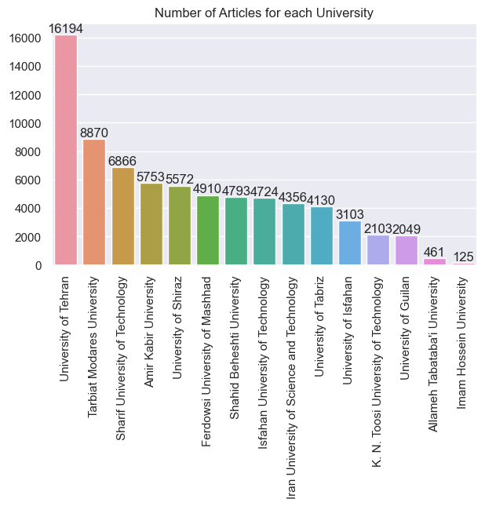

<!-- PROJECT SHIELDS -->


[](https://www.linkedin.com/in/raminferdos/)
[
](mailto:ferdos.ramin@gmail.com)
[](https://AlMetric-Research-Paper/)

<!-- PROJECT LOGO -->
<br />
<div align="center" id=readme-top>
  <h3 align="center">Iranian University Research Impact Analysis</h3>

  <p align="center">
    The Data, Code and Materials for the Iranian University Research Impact Analysis
    <br />
    <a href="https://github.com/SimplyRamin/AlMetric-Research-Paper"><strong>Explore the docs »</strong></a>
    <br />
    <br />
    <a href="https://github.com/SimplyRamin/AlMetric-Research-Paper">View Demo</a>
    ·
    <a href="https://github.com/SimplyRamin/AlMetric-Research-Paper/issues">Report Bug</a>
    ·
    <a href="https://github.com/SimplyRamin/AlMetric-Research-Paper/issues">Request Feature</a>
  </p>
</div>


<!-- TABLE OF CONTENTS -->
<details>
  <summary>Table of Contents</summary>
  <ol>
    <li>
      <a href="#about-the-project">About The Project</a>
      <ul>
        <li><a href="#overview">Overview</a></li>
        <li><a href="#methodology">Methodology</a></li>
        <li><a href="#data-collection">Data Collection</a></li>
        <li><a href="#data-preprocessing-and-analysis">Data Preprocessing and Analysis</a></li>
        <li><a href="#modeling">Modeling</a></li>
        <li><a href="#notebooks">Notebooks</a></li>
        <li><a href="#built-with">Built With</a></li>
      </ul>
    </li>
    <li>
      <a href="#project-structure">Project Structure</a>
    </li>
    <li><a href="#usage">Usage</a>
      <ul>
        <li>
          <a href="#consideration">Consideration</a>
        </li>
      </ul>
    </li>
    <li><a href="#contributing">Contributing</a></li>
    <li><a href="#license">License</a></li>
    <li><a href="#contact">Contact</a></li>
    <li><a href="#acknowledgments">Acknowledgments</a></li>
  </ol>
</details>


<!-- ABOUT THE PROJECT -->
## About The Project



### Overview

This repository houses the code and data for a research paper conducted by Ramin Ferdos and Ali Hossein Noorafrooz. In this study, we leverage data from Altmetric to analyze the impact and visibility of research output from Iranian universities on the global stage. Our analysis is based on a variety of metrics, including mentions in news articles, patent creation, policy influence, and more. We have followed the CRISP-DM (Cross-Industry Standard Process for Data Mining) methodology to guide our research.

### Research Objectives
Our primary objectives in this research include:

- ***Understanding Impact***: Assessing the global impact of research produced by Iranian universities.
- ***Multidimensional Analysis***: Analyzing research impact using diverse metrics, such as media mentions, patent creation, and policy influence.
- ***Data-Driven Insights***: Generating insights from the data to inform academic and policy decisions.

### Methodology

Our research is structured around the CRISP-DM framework, which involves the following key phases:

- ***Business Understanding***: Defining the research objectives and questions.

- ***Data Understanding***: Gathering and exploring the Altmetric data to understand its structure and potential insights.

- ***Data Preparation***: Cleaning and preprocessing the data to make it suitable for analysis.

- ***Data Analysis***: Conducting a comprehensive exploratory data analysis (EDA) to uncover patterns, trends, and outliers in the data.

- ***Modeling***: While traditional modeling is not a focus of this research, our analysis involves modeling in terms of data visualization and pattern recognition.

- ***Evaluation***: Assessing the impact of research from the top 15 Iranian universities based on various metrics.

- ***Deployment***: Sharing our findings and insights in a clear and accessible manner.

### Exploratory Data Analysis
Our EDA process involves a detailed exploration of the data, generating numerous insights. You can find the EDA notebooks in the notebooks. These notebooks provide a deep dive into the data, visualizations, and patterns we've discovered.

### Key Insights
Throughout our analysis, we have generated several key insights regarding the impact of Iranian university research. These insights are both quantitative and qualitative, and they are visualized to aid in understanding. Please refer to the notebooks and visualizations for a comprehensive view of our findings.

### Participating Universities
We have analyzed research output from the top 15 universities in Iran, as determined by the Ministry of Science and Research ratings. The list of universities can be found in the `Data` folder.

### Data Sources
Our primary data source is Altmetric, which provides valuable information about research impact across multiple dimensions.

### Built With

This research project was powered by a robust set of tools, libraries, and frameworks that facilitated data processing, analysis, and visualization:

- 
: The primary programming language for data manipulation, analysis, and visualization.

- : Used for interactive data exploration, analysis, and documentation, providing an intuitive environment for code execution and visualization.

- : A versatile data manipulation library for cleaning, processing, and analyzing structured data.

- Seaborn: A powerful statistical data visualization library that enhances the presentation of insights through beautiful and informative plots.

- : A widely-used data visualization library that offers extensive customization and control over plot aesthetics.

Feel free to explore the codebase to see how these elements come together to create this portfolio website.

<p align="right">(<a href="#readme-top">back to top</a>)</p>

<!-- HOW TO USE THIS REPOSITORY -->
## Usage
- Clone this repository to your local machine if you wish to replicate or build upon the work presented here.
```bash
git clone https://github.com/SimplyRamin/AlMetric-Research-Paper.git
```

- Open the notebook you want to check.

<!-- CONTRIBUTING -->
## Contributing

Contributions are what makes the open-source community such an amazing place to learn, inspire, and create. Any contributions you make are **greatly appreciated**.

If you have a suggestion that would make this better, please fork the repo and create a pull request. You can also simply open an issue with the tag "enhancement".
Don't forget to give the project a star! Thanks again!

1. Fork the Project
2. Create your Feature Branch (`git checkout -b feature/AmazingFeature`)
3. Commit your changes (`git commit -m 'Add some AmazingFeature'`)
4. Push to the Branch (`git push origin feature/AmazingFeature`)
5. Open a Pull Request

<p align="right">(<a href="#readme-top">back to top</a>)</p>


<!-- LICENSE -->
## License

Distributed under the MIT License. See `LICENSE.txt` for more information.

<p align="right">(<a href="#readme-top">back to top</a>)</p>


<!-- CONTACT -->
## Contact

Ramin F. - [@SimplyRamin](https://www.linkedin.com/in/raminferdos/) - ferdos.ramin@gmail.com - [Website](https://AlMetric-Research-Paper)

Project Link: [https://github.com/SimplyRamin/AlMetric-Research-Paper](https://github.com/SimplyRamin/AlMetric-Research-Paper)

<p align="right">(<a href="#readme-top">back to top</a>)</p>


<!-- ACKNOWLEDGMENTS -->
## Acknowledgments

I would like to express our gratitude to the data science community for its constant inspiration and support. This project is a testament to the power of data-driven insights and the endless possibilities they offer in understanding and optimizing social media engagement.

<p align="right">(<a href="#readme-top">back to top</a>)</p>